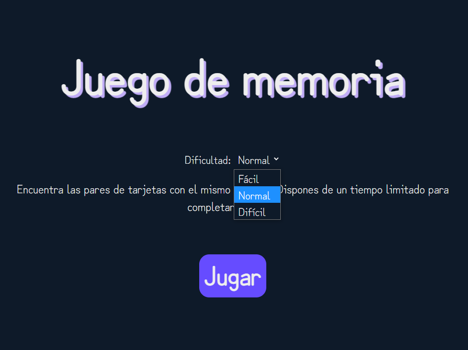
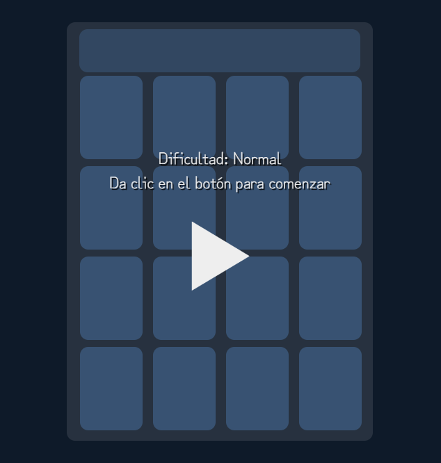
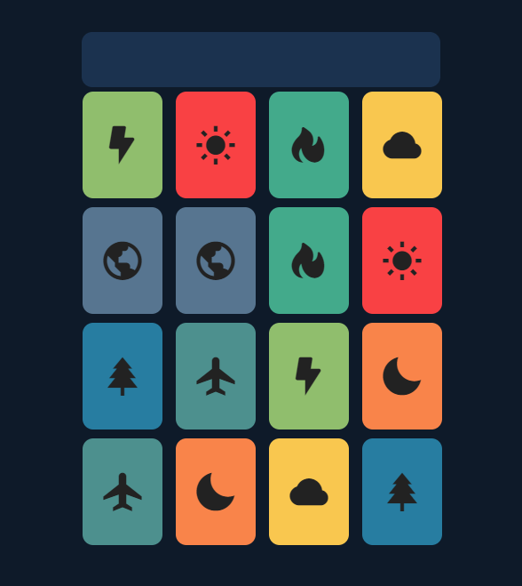
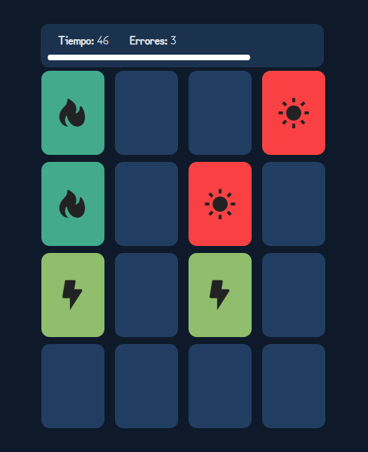
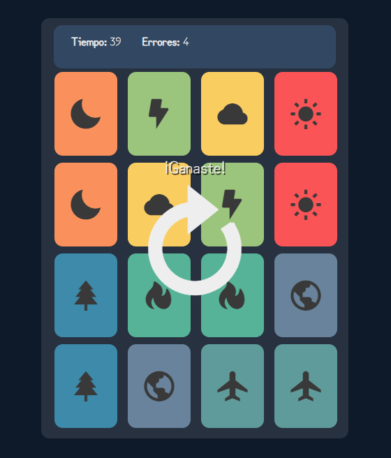
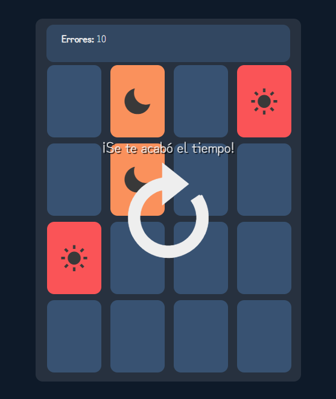

# Juego de memoria en Angular

Este projecto consiste en una simple implementación de un juego de memoria para un jugador, utilizando el framework de JavaScript para front-end, Angular. El juego ofrece 3 niveles de dificultad con diferentes mecánicas de tiempo cada una. 

## Objetivo

El principal objetivo de crear este proyecto utilizando Angular es para entender y practicar las funcionalidad básicas del framework. 

## Conceptos de Angular utilizados

Entre las funcionalidades de Angular que se usaron en la implementación del juego de memoria se encuentran:

- ``Interpolación``
- `Enlace de datos de dos vías`
- Directiva ``*ngIf``
- Directiva ``*ngFor``
- Directiva ``ngClass``
- Manejo de ``evento click``
- Uso de Subscribers
- Módulo interval
- Router y sus funcionalidades. 

## Funcionamiento de la aplicación

### Menú principal

Al abrir la aplicación se muestra la siguiente interfaz

Esta es la página principal de la página, desde esta interfaz es posible elegir la dificultad con la que se desea iniciar el juego de memoria. Para desplegar el menú con las dificultades, se utilizó el elemento `select` perteneciente a HTML. Dentro de este elemento, se declaró un ``enlace de datos de dos vías`` para poder obtener el valor del `select` automáticamente. Se utilizó ``[(ngModel)]`` perteneciente al módulo ``FormsModule`` de Angular. Para mostrar el texto de la dificultad, se utilizó `interpolación de cadenas`, que lee el texto que le corresponde (de acuerdo con las dificultad seleccionada en el `select`) desde un array dentro del código del componente.

Por último, se encuentra un boton con el texto Jugar; el botón implementa un enlace de eventos para obtener cuando se de click sobre él. Al dar click, se llama a la función `navigate()` dentro del código del componente; esta función utiliza el servicio del `router` de Angular para moverse a la interfaz del juego, pero con la dificultad seleccionada como parámetro. Este parámetro se leerá en la página del juego. 

### Página del juego

La página del juego, se compone de diferentes elementos, los cuales se muestran al usuario dependiendo del estado del juego, para esto se utiliza la directiva `*ngIf` y diferentes variables dentro del código del componente. En cada uno de los componentes que necesiten detectar cuando se de click sobre ellos, se utiliza el enlace de eventos `click`.

Antes de empezar a jugar, se muestra la siguiente interfaz:

Aquí, se muestra un mensaje indicando la dificultad que tendrá el juego así como un botón para iniciar a jugar. La dificultad se obtiene del parámetro enviando dentro de la URL; para obtenerlo se utiliza el servicio `ActivatedRoute` que proporciona el enrutamiento de Angular.

Al iniciar el juego, se da una pequeña cantidad de tiempo para mostrar la posición de las tarjetas, posteriormente se voltean de nueva cuenta para ocultar su símbolo. En cada juego, las posiciones de las tarjetas se obtienen aleatoriamente dentro del código del componente.

Si la dificultada seleccionada es normal o dificil, en la parte superior de la interfaz se muestra una sección con un temporizador, así como un contador de errores. Para llevar la cuenta del tiempo transcurrido se utilizó `interval` la cual es una utilidad incluida en el módulo `rxjs` de Angular que trabaja de manera similar a la función `setInterval()` de JavaScript, con la diferencia que implementa suscribers en su funcionamiento.

Al dar click sobre alguna de las tarjetas, esta se voltea y muestra su valor. Se pueden voltear cartas de dos en dos. Si el par de tarjetas es igual en símbolo y en color, estas se mantienen descubiertas; en caso contrario, ambas regresan a su posición original (ocultas)

Para ganar, es necesario encontrar cada uno de los pares de tarjetas identicas antes de que se acabe el tiempo.

En dificultades normal o difícil, si se acaba el contador de tiempo antes de que se encuentres todos los pares de tarjetas identicas, el jugador pierde la oportunidad de seguir jugando y se muestra el siguiente mensaje:

## Uso de Angular (autogenerado)

This project was generated with [Angular CLI](https://github.com/angular/angular-cli) version 12.2.5.

### Development server

Run `ng serve` for a dev server. Navigate to `http://localhost:4200/`. The app will automatically reload if you change any of the source files.

### Code scaffolding

Run `ng generate component component-name` to generate a new component. You can also use `ng generate directive|pipe|service|class|guard|interface|enum|module`.

### Build

Run `ng build` to build the project. The build artifacts will be stored in the `dist/` directory.

